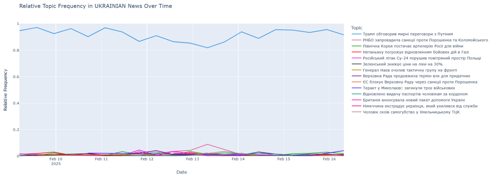
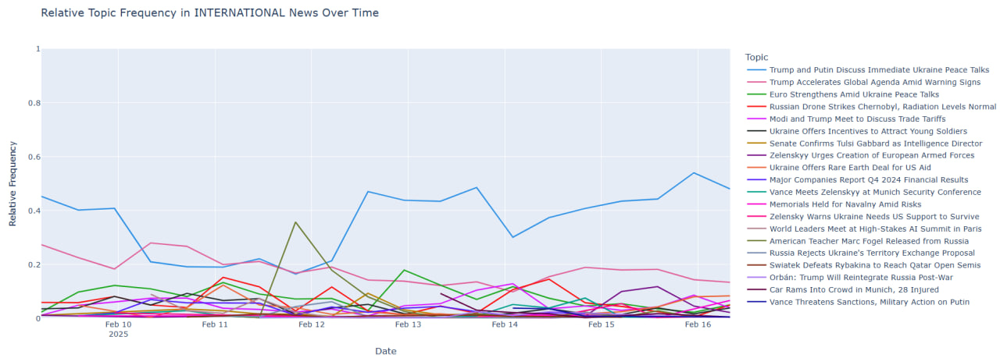
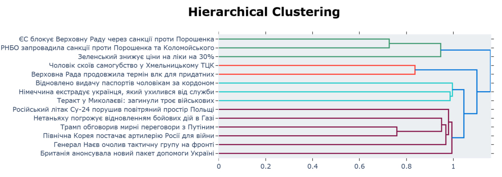
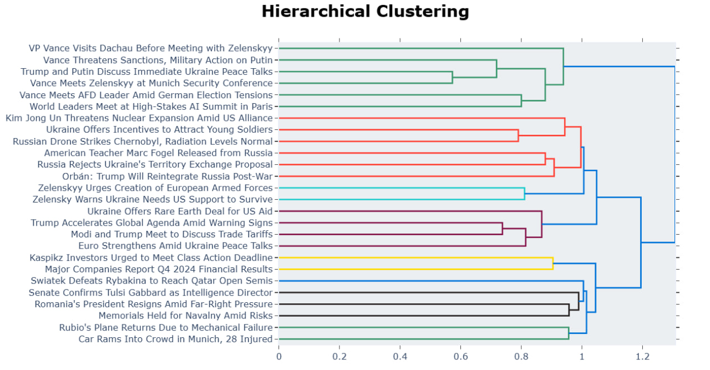

# BERTopic-News-Analysis

[](https://colab.research.google.com/drive/1OQ4zT1vK3qOv9vPLbwYnwv80WXxxvFG1?usp=sharing)

## Project Overview

This project focuses on identifying and analyzing key topics ("informational triggers" and "statements") within the media landscape, specifically differentiated between Ukrainian and international news. It leverages the advanced BERTopic topic modeling algorithm, which combines transformer-based models with clustering and topic representation, alongside integration with OpenAI for generating high-quality, specific topic names.

## Topic Modeling Task

**Primary Goal:** To identify specific informational triggers and statements within two distinct information spaces – Ukrainian and international news.
**Topic Format:** Topics should be formulated as concrete events or statements (e.g., "President's Statement on Energy Security," "Pension Reform Debates"), rather than broad categories ("Politics," "Economy").

**Input Data:** An Excel file with two sheets (or one sheet containing a 'Country' column for separation), with the following columns:
* `Date`
* `Source`
* `Headline`
* `Description`
* `Link`
* `Author`
* `Source Popularity`
* `Country`

* **Main Criterion:** Quality of topic extraction (relevance, clarity, avoidance of duplication).

## Why BERTopic is the Best Choice?

Among existing topic modeling algorithms such as LSA, LDA, NMF, KeyBERT, and Top2Vec, **BERTopic** was chosen for its exceptional ability to generate high-quality, coherent, and contextually aware topics, which is critically important for news data.

* **BERTopic** combines transformer-based embeddings (for deep contextual understanding of words) with HDBSCAN clustering (for identifying dense document clusters) and a modified TF-IDF technique (c-TF-IDF) to determine the words that best represent each topic. This allows it to replace documents with clusters in the original TF-IDF formula, then select the most important words for each cluster as its topic representation.

* **Top2Vec**, in contrast to BERTopic, generates topic representations by using words closest to the centroid of document clusters in the embedding space.

**BERTopic's core advantage:** It outperforms traditional models (LDA, NMF) by combining advanced transformer embeddings with clustering and class-based TF-IDF. This results in more coherent, multilingual, and context-aware topics, especially effective for short, real-world texts like news headlines. Integration with OpenAI further enhances the quality of topic names, making them concrete informational triggers.

## Project Structure

The repository is organized as follows to ensure clean and modular code:

BERTopic-News-Analysis/

├── illustrations/            # Folder for visualizations and illustrative outputs  
├── bertopic_module.py        # Contains logic for initializing the BERTopic model and OpenAI embeddings  
├── main.py                   # Main script that orchestrates the full topic modeling pipeline  
├── preprocessing.py          # Functions for data cleaning and preprocessing  
└── README.md                 # Project description and usage instructions

## Data Description

The input data is provided in an Excel file, which may contain two separate sheets (for Ukrainian and international news) or a single sheet with a 'Country' column for separation. Each entry includes metadata essential for detailed topic analysis and its dynamics: `Date`, `Source`, `Headline`, `Description`, `Link`, `Author`, `Source Popularity`, `Country`.

## Methodology and Analysis Process

The analysis is conducted separately for Ukrainian and international information spaces, following these steps:

### 1. Data Preprocessing (`preprocessing.py`)
* **Loading and Splitting:** The input Excel file is loaded, and data is split into separate DataFrames for Ukrainian and international news.
* **Document Formation:** For each entry, the `Headline` and `Description` are combined into a single text, which serves as the "document" for topic modeling.
* **Text Cleaning:** Basic cleaning is applied, including converting text to lowercase, removing punctuation, and normalizing spaces. A multilingual approach is used, preserving both Latin and Cyrillic characters.
* **Date Processing:** The `Date` column is converted to `datetime.datetime` objects for correct use in analyzing topics over time. Invalid dates and empty documents are removed.
* **Filtering Non-Informative Content:** Source filtering based on popularity (e.g., by quantiles) is applied to exclude sources with very low or excessively dominant popularity, which might introduce noise or distort the analysis.

### 2. BERTopic Model Configuration and Training (`bertopic_module.py`)
* **Universal Configuration:** Universal components that work well for both languages are used:
    * **Embedding Model:** `SentenceTransformer("paraphrase-multilingual-MiniLM-L12-v2")` for creating multilingual vector representations of documents.
    * **UMAP (Dimensionality Reduction):** For reducing the dimensionality of embeddings to 5 components, aiding in cluster discovery.
    * **HDBSCAN (Clustering):** For identifying dense clusters that become topics. `min_cluster_size` is tuned to achieve more coherent topics.
    * **CountVectorizer:** Used for topic representation, with `ngram_range=(1, 2)` to capture unigram and bigram phrases. Language-specific stop words are applied (Ukrainian for Ukrainian news, English for international).
* **Representation Model:**
    * **KeyBERT:** For extracting keywords that best describe the topic.
    * **Maximal Marginal Relevance (MMR):** For increasing the diversity of keywords.
    * **Part-of-Speech (POS):** Utilizes `spaCy` models (uk\_core\_news\_sm for Ukrainian, en\_core_web_sm for English) to extract meaningful parts of speech.
    * **OpenAI GPT-4o-mini:** A **crucial component** for generating specific, concise, and meaningful topic names (informational triggers) based on topic documents and keywords. This directly addresses the main quality criterion.
* **Training:** Models are trained separately for Ukrainian and international data, assigning a topic ID to each document.

### 3. Analysis and Visualization of Results (`main.py`, `bertopic_module.py`)

* **Topics over Time:**
    * Graphs of relative topic frequency over time are generated and visualized for both information spaces.
    * Frequency normalization is used to show the relative importance of topics in each period, allowing visualization of even dominant informational triggers (like "Trump Discussed Peace Talks with Putin") without overshadowing other topics.
    * OpenAI-generated topic names are used for clear identification of lines on the graph.
    * 
    * 

* **Inter-Topic Relationships:**
    * **Hierarchical Relationships (`visualize_hierarchy`):** A tree-like structure is built, showing how specific informational triggers group into broader categories, revealing the hierarchical structure of the information flow.
    * 
    * 

* **Comparative Analysis of Information Spaces:**
    * Shared and unique dominant topics in Ukrainian and international news are analyzed.
    * The dynamics of key informational triggers appearing and disappearing over time are compared between the two spaces.
    * Differences in focus or wording of similar topics are highlighted.

### 4. Optimization and Metadata Consideration

* **Efficiency and Optimization:** BERTopic is efficient for large datasets due to its use of transformer models and optimized clustering algorithms. Logic for saving/loading trained models is implemented to avoid retraining, significantly speeding up subsequent analyses.
* **Metadata Consideration:** The `Date` column is actively used for analyzing the temporal dynamics of topics. `Source Popularity` can be used for noise filtering.

## Instructions for Use

To run this analysis locally or in Google Colab, follow these steps:

1.  **Clone the repository:**
    ```bash
    git clone [https://github.com/your-username/BERTopic-News-Analysis.git](https://github.com/your-username/BERTopic-News-Analysis.git)
    cd BERTopic-News-Analysis
    ```

2.  **Create and activate a virtual environment (recommended):**
    ```bash
    python -m venv venv
    source venv/bin/activate  # For Linux/macOS
    # venv\Scripts\activate   # For Windows
    ```

3.  **Install dependencies:**
    ```bash
    pip install -r requirements.txt
    ```

4.  **Download spaCy language models:**
    These models are necessary for Part-of-Speech representation and potential advanced preprocessing of Ukrainian and English text:
    ```bash
    python -m spacy download uk_core_news_sm
    python -m spacy download en_core_web_sm
    ```

5.  **Set up your OpenAI API key:**
    The model uses OpenAI for generating topic names. Set your OpenAI API key as an environment variable:
    ```bash
    export OPENAI_API_KEY="your_openai_api_key_here"
    # OR for Windows: set OPENAI_API_KEY="your_openai_api_key_here"
    ```
    (Alternatively, add it to your system's environment variables).

6.  **Prepare your input data:**
    Place your Excel file with news data (with two sheets or a 'Country' column for separation) in the project's root directory or at the path specified in `main.py` (`EXCEL_FILE_PATH`).

7.  **Run the analysis:**
    ```bash
    python main.py
    ```
    Analysis results and visualizations will be printed to the console and opened in your web browser (as interactive Plotly graphs).

## Analysis Results and Conclusions

This section presents the key findings from the BERTopic analysis for both Ukrainian and International news spaces, highlighting dominant themes, their temporal dynamics, and a comparative overview.

### Ukrainian Information Space

The analysis of Ukrainian news reveals a focus on both internal governmental actions and direct impacts of the war, alongside international relations concerning aid and specific political figures.

**Dominant Topics (Informational Triggers) identified by OpenAI:**
* Topic -1 (Outliers): ['Під Москвою знищено два радіолокаційні комплекси РФ'] (Two Russian radar complexes destroyed near Moscow)
* Topic 0: ['Трамп обговорив мирні переговори з Путіним'] (Trump discussed peace talks with Putin)
* Topic 1: ['РНБО запровадила санкції проти Порошенка та Коломойського'] (National Security and Defense Council imposed sanctions against Poroshenko and Kolomoisky)
* Topic 2: ['Північна Корея постачає артилерію Росії для війни'] (North Korea supplies artillery to Russia for war)
* Topic 3: ['Верховна Рада продовжила термін влк для придатних'] (Verkhovna Rada extended military service for eligible)
* Topic 4: ['Нетаньяху погрожує відновленням бойових дій в Газі'] (Netanyahu threatens resumption of hostilities in Gaza)
* Topic 5: ['Російський літак Су-24 порушив повітряний простір Польщі'] (Russian Su-24 aircraft violated Polish airspace)
* Topic 6: ['Зеленський знижує ціни на ліки на 30%'] (Zelenskyy lowers medicine prices by 30%)
* Topic 7: ['Генерал Наєв очолив тактичну групу на фронті'] (General Nayev led a tactical group on the front)
* Topic 8: ['Британія анонсувала новий пакет допомоги Україні'] (Britain announced a new aid package for Ukraine)
* Topic 9: ['Відновлено видачу паспортів чоловікам за кордоном'] (Issuance of passports to men abroad resumed)
* Topic 10: ['ЄС блокує Верховну Раду через санкції проти Порошенка'] (EU blocks Verkhovna Rada over sanctions against Poroshenko)
* Topic 11: ['Теракт у Миколаєві: загинули троє військових'] (Terrorist attack in Mykolaiv: three soldiers killed)
* Topic 12: ['Чоловік скоїв самогубство у Хмельницькому ТЦК'] (Man committed suicide at Khmelnytskyi TCC)
* Topic 13: ['Німеччина екстрадує українця, який ухилився від служби'] (Germany extradites Ukrainian draft dodger)

**Key Observations:**
* **Domestic Focus:** A significant portion of Ukrainian news revolves around internal political decisions (e.g., sanctions, Verkhovna Rada actions), social policies (medicine prices, passports), and military-related domestic issues (VKL terms, TCC incident, extradition).
* **Direct War Impact:** Specific military events (terrorist attack in Mykolaiv) and general military leadership changes (General Nayev) are prominent.
* **International Support & Diplomacy:** News regarding foreign aid packages (Britain) and high-level diplomatic discussions (Trump on peace talks) is also important.
* **Outlier Topic:** Topic -1 "Під Москвою знищено два радіолокаційні комплекси РФ" (Two Russian radar complexes destroyed near Moscow) suggests highly specific, perhaps isolated, military reports.

### International Information Space

International news primarily focuses on global geopolitical dynamics, particularly concerning the war in Ukraine, major world leaders, and broader international affairs.

**Dominant Topics (Informational Triggers) identified by OpenAI:**
* Topic -1 (Outliers): ['Zelenskyy Meets Trump Officials Amid Ukraine War Talks']
* Topic 0: ['Trump and Putin Discuss Immediate Ukraine Peace Talks']
* Topic 1: ['Trump Accelerates Global Agenda Amid Warning Signs']
* Topic 2: ['Euro Strengthens Amid Ukraine Peace Talks']
* Topic 3: ['Russian Drone Strikes Chernobyl, Radiation Levels Normal']
* Topic 4: ['Modi and Trump Meet to Discuss Trade Tariffs']
* Topic 5: ['American Teacher Marc Fogel Released from Russia']
* Topic 6: ['Ukraine Offers Incentives to Attract Young Soldiers']
* Topic 7: ['Ukraine Offers Rare Earth Deal for US Aid']
* Topic 8: ['Major Companies Report Q4 2024 Financial Results']
* Topic 9: ['Senate Confirms Tulsi Gabbard as Intelligence Director']
* Topic 10: ['Car Rams Into Crowd in Munich, 28 Injured']
* Topic 11: ['Vance Meets Zelenskyy at Munich Security Conference']
* Topic 12: ['Zelenskyy Urges Creation of European Armed Forces']
* Topic 13: ['World Leaders Meet at High-Stakes AI Summit in Paris']
* Topic 14: ['Vance Threatens Sanctions, Military Action on Putin']
* Topic 15: ["Russia Rejects Ukraine's Territory Exchange Proposal"]
* Topic 16: ['Orbán: Trump Will Reintegrate Russia Post-War']
* Topic 17: ['Memorials Held for Navalny Amid Risks']
* Topic 18: ['Zelensky Warns Ukraine Needs US Support to Survive']
* Topic 19: ['Swiatek Defeats Rybakina to Reach Qatar Open Semis']
* Topic 20: ['Kim Jong Un Threatens Nuclear Expansion Amid US Alliance']
* Topic 21: ["Rubio's Plane Returns Due to Mechanical Failure"]
* Topic 22: ["Romania's President Resigns Amid Far-Right Pressure"]
* Topic 23: ['VP Vance Visits Dachau Before Meeting with Zelenskyy']
* Topic 24: ['Vance Meets AFD Leader Amid German Election Tensions']
* Topic 25: ['Kaspikz Investors Urged to Meet Class Action Deadline']

**Key Observations:**
* **Geopolitical Focus:** Extensive coverage of high-level diplomatic meetings (Trump-Putin, Vance-Zelenskyy, Modi-Trump, AI Summit), particularly concerning Ukraine and major global powers.
* **US Politics Influence:** Presence of US political figures (Trump, Gabbard, Rubio, Vance) in various contexts, indicating their global impact.
* **Ukraine's Global Role:** While about Ukraine, the themes often involve its interactions on the global stage (aid deals, urging European forces, peace talks).
* **Broader Global Issues:** Includes topics like economic reports, specific international incidents (Munich car crash), and even sports (Swiatek in Qatar Open), showing a wider scope than the Ukrainian news.
* **Outlier Topic:** Topic -1 "Zelenskyy Meets Trump Officials Amid Ukraine War Talks" still relates to high-level diplomatic efforts, suggesting that even outliers maintain a significant international political context.

### Comparative Analysis

The comparative analysis reveals both shared and distinct informational landscapes:

* **Shared Topics:** The most prominent overlap is the consistent focus on **"Trump and Putin Discuss Immediate Ukraine Peace Talks"** (Topic 0 in both datasets). This highlights a globally recognized and highly significant informational trigger. Similarly, discussions around **Ukraine's need for support and aid** (Ukrainian Topic 8: 'Британія анонсувала новий пакет допомоги Україні' vs. International Topic 18: 'Zelensky Warns Ukraine Needs US Support to Survive', Topic 7: 'Ukraine Offers Rare Earth Deal for US Aid') appear in both spaces.
* **Unique Topics (Ukrainian Focus):** Ukrainian news delves more into **internal political struggles** (sanctions against Poroshenko/Kolomoisky, EU blocking Verkhovna Rada) and **specific domestic social/military issues** (passport issuance, TCC incidents, extradition of draft dodgers). These are granular details of Ukrainian daily life and governance that receive less direct attention internationally.
* **Unique Topics (International Focus):** International news covers a broader array of **global leaders' meetings** (Modi-Trump, AI Summit, Vance with various figures), **major economic news** (Q4 reports), and **diverse international incidents** (Munich car ramming, Navalny memorials, Kim Jong Un's threats, sports events). The focus shifts to how Ukraine fits into a larger global narrative, rather than its internal mechanics.
* **Differences in Focus:** While both discuss the war, Ukrainian news often frames it from a direct military/societal impact perspective, while international news tends to frame it through the lens of **high-level diplomacy, sanctions, and global power dynamics**. For instance, Ukrainian news mentions 'Російський літак Су-24 порушив повітряний простір Польщі' (a direct border incident), whereas international news focuses more on 'Vance Threatens Sanctions, Military Action on Putin' (broader policy responses).
* **Temporal Dynamics:** (This would be best observed through the generated `Topics over Time` plots, which show peaks and troughs.) We would expect to see synchronized peaks for major global events like peace talk discussions, while local incidents (e.g., TCC suicide, Mykolaiv attack) would likely show peaks primarily in the Ukrainian news.

### Quality of Topic Names

The OpenAI-generated topic names are remarkably **specific, concise, and highly informative**, directly aligning with the task requirement of identifying "informational triggers" rather than generic categories. For example, "РНБО запровадила санкції проти Порошенка та Коломойського" (NSDC imposed sanctions against Poroshenko and Kolomoisky) or "Trump and Putin Discuss Immediate Ukraine Peace Talks" are excellent examples of concrete news headlines that capture the essence of a topic. This significantly enhances the interpretability and value of the topic modeling results.

### General Conclusions

The project successfully demonstrates the capability of BERTopic, augmented by OpenAI's language models, to accurately extract and label meaningful informational triggers from large volumes of news data across different languages. The distinct sets of topics and their varying prominence in Ukrainian versus international media provide valuable insights into the differing priorities and perspectives of these information spaces. The ability to track these triggers over time further enriches the analysis, allowing for the identification of evolving narratives and critical junctures.

---